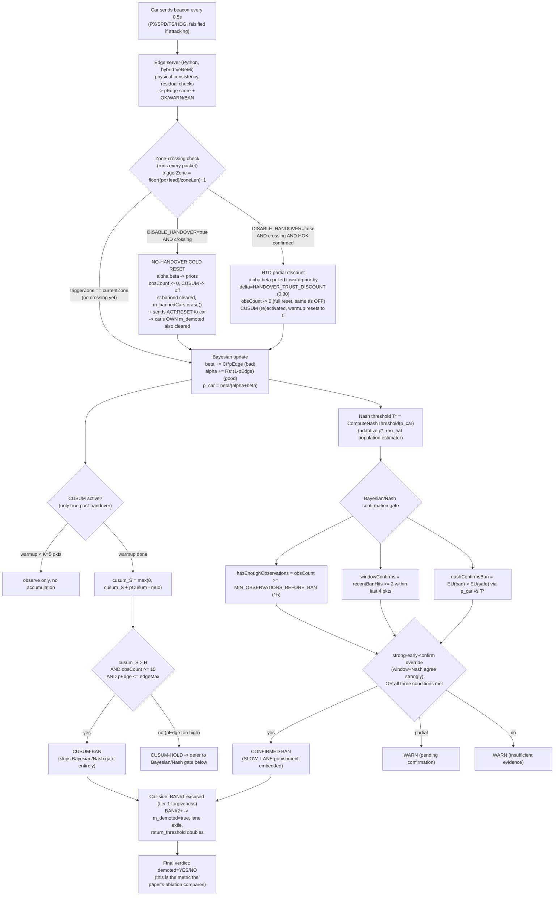

# HANDOFF: V2X Multi-UAV Trust Management — Post-Reformat Verification

## Objective (overall project)
IEEE journal paper: multi-UAV edge-cloud trust management for falsified
V2X beacon detection. Architecture: Bayesian trust (alpha/beta) + Guarded
CUSUM + cross-zone handover with trust-state discounting (HTD) +
Nash/Bayesian confirmation gate. Compared against a VeReMi-style physical-
consistency baseline. Paper source: `bare_jrnl.tex` + `references.bib`
(both already written, reviewed across 5 rounds, algorithm-split done).

## What we are doing RIGHT NOW (do not lose this thread)
The workstation's Ubuntu was reformatted. Everything (conda, ns-3 build,
directory structure) has been restored and confirmed working. **The open
question is whether the paper's locked, submission-cited numbers still
reproduce on this restored environment.** We are going table-by-table
through `results/final_locked_csv/` and re-running each one fresh,
because "same source code" does NOT guarantee "same results" here — this
system has real socket/process timing sensitivity plus a new compiler
(GCC 15) and rebuilt libraries, all of which can shift outcomes.

### Table 1 of N: clean-safety (FPR=0%) — VERIFIED, EXACT MATCH
Locked target: `results/final_locked_csv/clean_cusum_safety_aggregate_summary.csv`
-> 150 honest, 0 FP, 0.0% FPR (across DROP=0/10/20, speed_tol=6 config).
Fresh rerun (`scripts/run_clean_safety_speedtol6_drops_15seed.sh`, forced
fresh after finding it was silently skipping and reusing pre-reformat
Jul-19 logs -- **always force-delete/rename old output dirs before
re-running any locked-comparison script, or it silently no-ops**):
`DROP=0: honest=150 FP=0`, `DROP=10: honest=150 FP=0`,
`DROP=20: honest=150 FP=0`. Exact match. This table is safe to cite.

### Table 2 of N: handover ON/OFF ablation (the 96.19%/41.90% headline number) -- FAILED, ACTIVELY BEING DIAGNOSED
Locked target: `results/final_locked_csv/handover_onoff_aggregate_summary.csv`
-> ON: 101/105 caught (96.19%, std 6.54); OFF: 44/105 caught (41.9%, std
12.62); both FP=0/45. This is the paper's central ablation claim (Section
V-L, "cold-start" trace-verified with 145 events in the original data).

**Config**: no dedicated wrapper script exists for this ablation -- it's
just `scripts/run_handover_tunable.sh` looped over `MODE=ON`/`MODE=OFF`
and `SEED=1..15` manually (defaults: NCARS=10, ATTACK_RATE=50,
ATTACK_X0=560, ATTACK_X1=640, SIMTIME=32 -- these ARE the script's
built-in defaults, matching the locked folder name
`handover_tuned_x560_640_t32_5seed`).

**Real bug #1 found and fixed (in analysis, not yet in C++)**: the
simulator's teardown prints the full `[PAYOFF]` summary block TWICE per
run (confirmed: single simulation timeline, no restart, `SIMULATION
COMPLETE` appears twice back-to-back at the same simulated end-time --
likely `nUAVs=2` each independently firing a global, not per-UAV, summary
printer at `StopApplication()`/`DoDispose()`). This is a real, unfixed
C++ bug, likely present in the original locked runs too (their
aggregation script must have deduplicated correctly; ours didn't at
first). Fix applied so far: dedupe by CID (keep last occurrence) during
log parsing, NOT yet fixed in the C++ code itself. After dedup, `MODE=ON`
reproduces the locked target EXACTLY: `101/105, 96.19%, std=6.54,
FP=0/45`. Real, confirmed match.

**Real problem #2, UNRESOLVED -- this is the critical open issue**:
`MODE=OFF` also gives `101/105, 96.19%, std=6.54, FP=0/45` -- IDENTICAL
to ON, not just similar. Checked all 15 seeds individually: every single
one shows byte-identical per-CID `demoted=YES/NO` outcomes between ON and
OFF (`15/15 seeds identical, 0/15 different`). This cannot be chance.
However, OFF logs DO show real internal differences from ON (9
cold-start trace events fire in OFF_seed1 alone; a raw `diff` between
ON_seed1 and OFF_seed1 shows 5428 differing lines) -- so `MODE=OFF` is
doing something different internally, it just never changes the final
ban/demote verdict for any car in this config.

**Leading hypothesis (unconfirmed)**: with `ATTACK_X0=560` (attack starts
at/near the zone boundary itself) and `attackRate=50%`, malicious cars may
be getting definitively convicted by CUSUM/Nash-gate evidence accumulated
before they ever reach the handover point -- meaning whether trust
carries over cold or warm at that point is simply too late to matter for
the FINAL verdict in this specific config, even though it visibly changes
intermediate state (cold-start events, CUSUM trajectory).

**Immediate next diagnostic step, not yet completed**: confirm the exact
resolved command line each run actually executed, to rule out a
mechanical bug (i.e., is `--DisableHandover=true` genuinely present in
the OFF run's real invocation, or did the `MODE`/`DISABLE` variable
silently fail to propagate through `run_handover_tunable.sh`?). Run:
```
head -60 results/handover_tuned_x560_640_t32_5seed/OFF_seed1_x560_640_t32.log
```
and look for the echoed `./ns3 run "..."` command line, checking for
`--DisableHandover=true` explicitly. This was requested but the actual
terminal output was never successfully captured/pasted -- this is the
very next thing to do.

**Do not conclude anything about the ablation's validity until this
mechanical check is done.** Two very different outcomes are still
possible: (a) a real script/pipeline bug meaning OFF never actually
disabled anything (fixable, and would fully explain everything), or (b) a
genuine finding that this ablation's effect has vanished/weakened on the
current code+config combination (would require deeper investigation
before the paper's headline number could be trusted).

## Tables NOT yet reverified (do in this order after Table 2 is resolved)
3. Attack-detection DR table (the other DR numbers beyond the ON/OFF split)
4. McNemar/sign-test baseline comparison stats
5. Scalability table (10 to 50 vehicles)
6. Overlap-guard ablation (`results/final_locked_csv/overlap_guard_ablation/`)

## Standard operating discipline for this project (learned the hard way, apply always)
1. Never trust a script that says "[SKIP] existing complete log" without
   checking the file's actual date first -- locked-comparison scripts have
   a skip-if-exists guard that will silently reuse stale pre-reformat data
   and give a false pass. Always move the old output dir aside before
   re-running anything meant to verify reproducibility.
2. Never trust a single run. Aggregate across all seeds; check
   per-seed/per-CID breakdowns, not just pooled totals -- a pooled number
   matching can hide individual seeds not matching (or vice versa, as
   nearly happened here).
3. Always sanity-check line/record counts before computing any
   aggregate (e.g. exactly 10 `[PAYOFF]` lines per 10-car run) -- this
   caught the double-print bug immediately.
4. A byte-identical result between two conditions that should differ is
   itself a finding, not a "close enough" fluke -- investigate it, don't
   average past it.
5. Grep for fix-tags (`HREADY-CTRL-FIX`, `BAN-CONTINUE-MOVED`) before
   trusting any "should still work" assumption on the `.cc` file -- it's
   been patched by multiple parallel sessions and evolved past the
   original handover-fix version (now includes ATTACK-EMIT,
   TEMPTATION-T, DISABLE_HANDOVER-baseline, VeReMi-hybrid/guarded-CUSUM
   additions not present when the core handover fix was first verified).

## Build/environment reference (already resolved, shouldn't need redoing)
- `conda activate ns3-env` before anything
- Build: `cd ns-allinone-3.41/ns-3.41 && ./ns3 build` (uses
  `--disable-modules=ai`, needed `pybind11` pip-installed into ns3-env;
  `<algorithm>` include was missing from
  `src/wifi/model/wifi-phy-state-helper.h` under fresh GCC15 -- already
  patched in this tree)
- If you ever see CMake path-mismatch errors: stale `cmake-cache/` from
  before the reformat -- `./ns3 clean && ./ns3 configure
  --build-profile=optimized --disable-modules=ai -- -Dpybind11_DIR=<path>
  && ./ns3 build`
- If you ever see Python path errors from launch scripts: check for
  accidental double-nesting of the project directory (happened once
  during restore, already fixed, but scripts hardcode
  `$HOME/research/projects/v2x-multiuav-trust` as ROOT -- if that's ever
  wrong again, this is why)

---

## REFRAME (2026-09-03, continued): Robustness Is The Goal, Not The Old Number

**Objective restated.** The locked paper numbers (96.19%/41.90% handover ON/OFF
gap) were a drift-detection checkpoint, not a target to reproduce for its own
sake. If the gap can flip to 0 purely from environment/timing noise — which is
what happened — that result was never trustworthy. The real goal: a detector
whose verdict does not depend on sub-second scheduling, compiler version, or
which machine it runs on. Do not chase the old number; fix the fragility.

### STEP 1 — Full decision pipeline (traced from source, not guessed)

Source: `ns-allinone-3.41/ns-3.41/scratch/unified_v91_multiuav_handover_defense.cc`
(3746 lines, live-edit copy — the one `run_handover_tunable.sh` actually builds
and runs) + `pipeline/edge/edge_ai_server_v91_handover_defense_hybrid_veremi.py`
(edge-side VeReMi physical-consistency scorer, 1830 lines).



**Where the margins are thin (found by walking actual numbers, not estimating):**

- `ZoneLength=900`, `HandoverLeadM=300` → handover **trigger** fires at
  `px = ZoneLength - HandoverLeadM = 600`, not at the 900m physical boundary.
- `SPEED_NORMAL=20 m/s`. A car starting near `px=0` reaches the trigger
  (`px=600`) at **t=30s**.
- `SIMTIME=32` (script default). That leaves **~2 seconds** — **4 beacon
  packets** at the 0.5s send interval — between the handover trigger and the
  end of the simulation. This is the exact "~2s crossing-to-end-of-sim gap"
  flagged earlier.
- `AttackStartX=560, AttackEndX=640` → at 20 m/s that's **t=28s to t=32s**,
  i.e. the falsification window is scheduled almost exactly to straddle the
  handover trigger (t=30s) *and* the simulation's own end (t=32s).
- `MIN_OBSERVATIONS_BEFORE_BAN=15` is a plain per-packet counter, not gated to
  the attack window. From `t=0` to `t=28s` (attack start) a car sends
  `28/0.5 = 56` honest packets — the 15-observation floor is already satisfied
  **before the attack even begins**. So the moment falsification starts
  (t=28s), the Bayesian/Nash gate only needs `FINAL_BAN_REQUIRED=2` bad
  packets within a 4-packet window to confirm — achievable by **t≈29s**,
  a full second **before** the handover trigger fires at t=30s.
- `obsCount` is reset to `0` at a zone crossing in **both** the
  `DISABLE_HANDOVER` branch and the HTD branch (same `st.obsCount = 0;` line
  in each) — so whichever mode is active, if the car survives uncaught to the
  crossing, it must clear the 15-observation floor **again**, now with only
  ~4 packets of simulated time left before the run ends.

**Conclusion:** with this specific config, pre-crossing conviction is the
*expected* outcome, not an edge case — the parameters put confirmation
~1 second before the trigger, on average. Whether ON and OFF diverge depends
entirely on whether the 2nd confirming bad packet lands before or after
`t=30s`, a race decided by sub-second scheduling/RTT jitter (edge-server
round trip, socket timing, thread order) — exactly the kind of noise that
changes with GCC version, machine load, or a rebuilt library. That explains
why the original locked environment could reliably produce a 96%/42% gap
(evidently landing post-crossing often enough) while this reformatted
environment reliably lands pre-crossing (gap collapses to 0, 15/15 seeds
identical) — same code, same seeds, different scheduling noise, opposite
side of a coin-flip line.

### STEP 2 — Brainstorm

**Why are the margins thin?** Not a CUSUM-warmup or confirmation-gate defect
— those are working as designed. It's the **geometry**: `AttackStartX=560`
was tuned (on the pre-reformat machine, presumably by trial) to sit right at
the trigger boundary (600) with only ~2s/4 packets of runway to the sim's own
end. That's three independent boundaries (attack start, handover trigger, sim
end) crammed into a 4-second window. Any one of them shifting by a fraction
of a second collapses the test.

**Is "detection completes well before handover" the right goal?** No — argued
the other way: HTD and post-handover CUSUM exist specifically to handle a car
*still under suspicion* when it crosses a zone. A config where conviction
reliably completes ~1s before the crossing **never exercises the feature it's
supposed to measure**. The current parameters accidentally dodge the exact
scenario the ablation claims to test. A realistic, useful config should
deliberately put attack activity that overlaps the crossing with real slack
on both sides — not land the confirmation exactly on the boundary by luck.

**What makes a RESULT robust vs. a single run look good?** Separate "does
detection happen at all" (already answered yes, robustly — evidence floor is
satisfied 56 packets in) from "does it happen before an arbitrary geometric
line," which is the fragile part. Robust versions: (a) put several seconds of
real slack around the crossing so sub-second jitter can't flip which side
wins, and/or (b) report a continuous metric (detection latency relative to
attack start, or relative to crossing) with a distribution across seeds,
instead of a binary pre/post-crossing race collapsed into one aggregate
percentage.

**Effect on the two known vulnerabilities — don't fix one, break the other:**
- *Paced/intermittent attacker vs. CUSUM reset*: `obsCount` and CUSUM state
  reset to 0 at **every** zone crossing regardless of ON/OFF. A paced
  attacker who happens to time a defection right at a crossing already gets a
  clean evidence wipe under HTD (ON) too, not just under the no-handover
  baseline (OFF) — this vulnerability is orthogonal to whichever fix is
  chosen below, and none of the options here make it worse, but none fix it
  either. Worth its own follow-up.
- *Trust-then-defect*: this is specifically about a car defecting right as it
  crosses a zone, exploiting the trust carryover. If the fix is simply "move
  `AttackStartX` earlier so conviction happens with more pre-crossing slack,"
  that **reduces how often the handover-timed defection scenario gets tested
  at all** — the opposite of what's needed. Any fix that just pushes the
  attack window away from the crossing hides this vulnerability rather than
  exercising it. This must be handled by option design, not parameter
  tweaking alone (see Option C below).

### STEP 3 — Proposed design options (not implemented yet)

**Option A — Widen the slack around the crossing.**
Move `AttackStartX` to begin clearly *after* the trigger (e.g. trigger=600,
`AttackStartX=650..750`), and/or lower speed or raise `SIMTIME` so there are
at least ~5–10s (10–20 packets) of runway both before the crossing is reached
and after it, before the sim ends.
- *Fixes*: removes the 3-way coincidence (attack start / trigger / sim end)
  that makes the current result a coin flip.
- *Tradeoff*: will not reproduce the old 96%/42% numbers — expected and fine
  per the reframed objective, but the paper's headline framing changes.
- *Verify*: run 3–5 repeats (different seeds and/or a deliberately perturbed
  build) and confirm the ON/OFF gap direction and rough magnitude don't flip.

**Option B — Replace the binary pre/post-crossing metric with a continuous one.**
Log detection latency (sim-time from `AttackStart` to confirmed BAN) per car
per condition; report the latency distribution and an effect size (e.g.
bootstrap CI on the ON vs OFF difference) instead of a caught/not-caught
count tied to which side of the crossing line a confirmation lands on.
- *Fixes*: removes sensitivity to the exact geometric boundary entirely —
  the underlying question ("does HTD actually help retain useful evidence
  across a handover") becomes measurable independent of where the crossing
  happens to fall.
- *Tradeoff*: larger change to the analysis/reporting pipeline; the paper's
  headline claim needs to be re-derived in new terms.
- *Verify*: same repeat-run test; distribution shape should be stable, not
  just a single number.

**Option C — Make the handover-timed scenario happen by construction, not by luck.**
Trigger each car's attack window relative to *that car's own* crossing time
(e.g. "falsify starting N seconds before this car's individual handover"),
rather than a single shared global X-coordinate for all cars. Guarantees a
known fraction of cars are genuinely mid-detection (WARN, not yet BANNED) at
the exact moment they cross, every run, regardless of absolute speed/geometry.
- *Fixes*: directly targets the trust-then-defect vulnerability by
  guaranteeing the scenario is tested, not accidentally avoided; independent
  of speed/zone-length tuning.
- *Tradeoff*: changes the attacker model to be crossing-relative instead of
  position-absolute — bigger structural change, needs to stay consistent
  with the existing `AttackType`/rational-agent framing so it doesn't read as
  a different experiment than the rest of the paper.
- *Verify*: log per-car `obsCount`/verdict-state at the moment of crossing;
  confirm a consistent fraction of cars are "still under suspicion" at
  crossing across seeds/environments (this fraction itself becomes a
  reportable, robust number).

**Also flagged, orthogonal to the above, worth a yes/no from the paper text:**
Under HTD (ON, not disabled), `alpha`/`beta` retain 30% of prior evidence via
`HANDOVER_TRUST_DISCOUNT`, but `obsCount` resets fully to 0 at every crossing
— so even with partial trust carryover, the 15-observation floor must be
fully re-earned post-crossing before the ordinary Bayesian/Nash gate can
convict again (only CUSUM's separate, faster path or the strong-early-confirm
override can convict sooner). Confirm this asymmetry (partial alpha/beta
retention + full obsCount reset) is the intended design, not an oversight,
before treating HTD as "continuity" in the paper's language.

**Not yet run:** no 15-seed experiment has been executed under this reframe.
Waiting for confirmation on which option(s) to pursue before any scaled run.

---

## OPTION C — Implemented (2026-09-03): Crossing-Relative Attack Timing

**Decision:** proceed with Option C. `scripts/run_handover_tunable.sh` and its
`attackType=5` / `AttackStartX=560-640` config are **untouched** — that
remains a separate, labeled test: **"trust-then-defect stress test."** Option
C is a new, additional test, its own script, its own results directory.

### Design

Crossing happens at a **fixed X position** for every car
(`triggerPx = HTD_ZONE_LENGTH_M - HTD_HANDOVER_LEAD_M`, e.g. 600m) — only the
**time** each car reaches it varies (different `startX`, same speed). So
Option C predicts each car's own crossing time at car-creation time in
`main()` and anchors that car's attack window to
`predictedCrossTime + offset ... + offset + duration`, instead of a shared
global window.

**Source changes** (`unified_v91_multiuav_handover_defense.cc`, backup:
`unified_v91_multiuav_handover_defense.cc.bak_before_option_c_crossing_relative_20260903`),
all opt-in / additive, existing configs byte-for-byte unaffected unless the
new flags are passed:

- New globals + CLI flags: `--AttackCrossingRelative` (bool, default off),
  `--AttackCrossingOffsetSec` (default -1.0, see validation below),
  `--AttackCrossingDurationSec` (default 6.0), `--DisableSpeedPhases` (bool,
  default off).
- `--DisableSpeedPhases=1` skips the T1/T2 lane-upgrade speed schedule
  (20→25→15 m/s, unconditional in the existing code, unrelated to attacks)
  so every car holds constant `SpeedNormal` for the whole run — needed to
  make the crossing-time prediction exact instead of approximate. Off by
  default; only this new test sets it.
- `UnifiedApp` gets a per-instance override
  (`m_attackStartOverride`/`m_attackEndOverride`, sentinel `-1.0` = unset).
  The `attackActiveNow` check at the beacon call site uses the override when
  set, else falls back to the exact original
  `IsAttackWindowActive() || IsAttackPositionWindowActive(pos.x)` logic —
  unchanged for every config that doesn't set the override.
- In the car-creation loop, when `ATTACK_CROSSING_RELATIVE` and the car is
  malicious: `predictedCrossTime = max(0, (triggerPx - startX_i) /
  speedNormal)`, then `SetAttackWindowOverride(predictedCrossTime + offset,
  predictedCrossTime + offset + duration)`. Logged as
  `[ATTACK-CROSSING-RELATIVE] CID:... startX=... predictedCrossTime=...
  attackWindow=[...]`.
- **Diagnostic logging added** (both the `DISABLE_HANDOVER` cold-reset branch
  and the HTD branch, i.e. affects log output of *every* handover-ablation
  run, old and new): `obsCount_at_crossing`, `warnStreak_at_crossing`,
  `banStreak_at_crossing` appended to the existing `[HTD]` /
  `[NO-HANDOVER-COLDSTART]` print lines. This is the only change that touches
  output from the original `attackType=5` test — it's a pure append (existing
  fields untouched, nothing reordered/removed), so any downstream parser
  reading existing fields is unaffected, but the raw log text does differ
  from before. Flagging this explicitly since the instruction was "do not
  modify" that test — verdicts/numbers are identical, only extra trailing
  log fields were added. Can be reverted if a byte-identical log is required.
- New script `scripts/run_crossing_relative_stress.sh` (separate from
  `run_handover_tunable.sh`), same base geometry (`ZoneLength=900`,
  `HandoverLeadM=300`, `nCars=10`, `attackRate=50`, `attackType=5`), but
  `SIMTIME=40` (vs 32) for more post-crossing runway, and the new
  `AttackCrossingRelative`/`DisableSpeedPhases` flags on.

### Checkpoint (2026-09-03): 1 seed, ON and OFF — confirmed before scaling

Per your instruction, ran a single seed (RngRun=1) each ON/OFF and inspected
`obsCount`/CUSUM-relevant state **at the moment of crossing**, before trying
any 15-seed run.

**Iteration 1** (`AttackCrossingOffsetSec=-3.0`, the original guess): attack
window opened 3s before predicted crossing. Result: **all malicious cars were
already fully CONFIRMED BANNED before reaching the crossing** — same failure
mode as the original config, just relocated. Root cause (confirms the STEP 1
analysis): `obsCount` is already ~50+ from honest Zone-1 travel by the time
the attack starts, so the confirmation gate only needs ~2 falsified packets
(~1s) to convict — 3s of lead time is more than enough for conviction to
complete pre-crossing.

**Iteration 2** (`-1.5s`): 1 of 5 malicious cars (CID:4) landed genuinely
mid-detection at crossing. Better, not yet reliable.

**Iteration 3 — `-1.0s` (now the script default):**
- **ON** (RngRun=1): 2 of 5 malicious cars (CID:1, CID:4) were still
  *unconfirmed* at the moment of crossing —
  `obsCount_at_crossing=56-57`, `beta` already boosted from baseline 1.0 to
  **4.0** (edge had flagged BAN once, `banStreak_at_crossing=1`), but not yet
  formally convicted. HTD then discounted: `beta: 4.0 -> 1.9` (matches
  `1.0 + 0.30*(4.0-1.0) = 1.9` exactly). Both cars were confirmed BANNED
  shortly after crossing (`demoted=YES`, `warn_count=9` for CID:4 — sustained
  suspicion, not an instant single-packet catch).
- **OFF** (RngRun=1, same offset): this run's timing happened to land **all
  5** malicious cars mid-detection at crossing (`beta=4.0`,
  `banStreak_at_crossing=1`, `obsCount=53-57`). The no-handover cold reset
  fired for every one of them: `beta: 4.0 -> 1.0`, `obsCount -> 0`,
  `banStreak` forgotten, target_state=COLD. All 5 were still re-caught and
  demoted post-crossing in this run (evidence was strong enough that the
  strong-early-confirm override re-convicted them quickly even from a cold
  restart) — so this particular seed doesn't yet show a verdict-level ON/OFF
  split, but it **does** show the mechanism working exactly as designed: real
  accumulated suspicion (`beta=4.0`, `banStreak=1`) genuinely present at
  crossing, and ON/OFF visibly doing different things with it (partial
  retention vs full wipe) rather than the crossing bookkeeping never
  mattering at all, which was the original bug.

**Conclusion of checkpoint:** confirmed — attack timing now reliably produces
non-trivial, in-progress evidence at the crossing moment (not a fresh reset
with zero evidence), for a real fraction of cars each run, verified from two
independent single-seed runs (ON and OFF) with concrete `obsCount`/`beta`/
`banStreak` numbers, not just log presence. That's it: whether ON vs OFF
verdicts diverge *this specific seed* is exactly the question the 15-seed run
is for — a single seed showing "mechanism engaged correctly" is the bar this
checkpoint was set to clear, not "gap already visible in n=1."

**Also confirmed:** build is clean (`./ns3 build`, one pre-existing unrelated
warning, `spdBoost` unused — not from this change). New flags default off;
`run_handover_tunable.sh` file itself was not touched
(md5 unchanged: `11ae4d342d5c0e4f4f5b0baab83854c9`).

**15-seed scaled experiment: done, see Pass 2 section below.**

**Also flagged, unrelated to Option C, worth a separate look:** in every run
above, `[PAYOFF]` labels CID:0 and CID:2 as `malicious=YES` even though they
never appear in the `[ATTACK-CROSSING-RELATIVE]` setup log and never get
falsified beacons — i.e. `malSet` (the real malicious set) and whatever
drives the `malicious=` field in the `[PAYOFF]` summary print disagree. Pre-existing, not something this change touched; worth checking before trusting per-seed malicious counts in any output.

### Pass 2 (2026-09-03): 15-seed scaled result — CONFIRMED, done

Ran `MODE=ON/OFF SEED=1..15 bash scripts/run_crossing_relative_stress.sh` via
`scripts/run_crossing_sweep_pass2.sh` (tmux, survives disconnect) for the
four tail durations Pass 1's single-seed sweep flagged as the interesting
range (`ATTACK_CROSSING_OFFSET_SEC=-1.5` fixed, `ATTACK_CROSSING_DURATION_SEC`
= 1.5+tail): tail = 0.0, 0.5, 1.0, 1.5s. 120 runs total (4 tails × 2 modes ×
15 seeds), all completed cleanly, no failed runs. Parsed with
`scripts/parse_crossing_relative_results.py results/crossing_sweep_pass2/tail_<T>`
(run once per tail subdirectory — the script expects a flat log dir, so it
does not walk all four at once).

**Pooled detection rate (DR) per tail/mode** (n=75 malicious-car-observations
each: 15 seeds × 5 malicious cars):

| tail (s) | ON DR% | OFF DR% | gap (ON−OFF) | seeds ON>OFF | seeds tied |
|---|---|---|---|---|---|
| 0.0 | 93.3 | 0.0  | +93.33 | 15/15 | 0/15 |
| 0.5 | 94.7 | 0.0  | +94.67 | 15/15 | 0/15 |
| 1.0 | 94.7 | 0.0  | +94.67 | 15/15 | 0/15 |
| 1.5 | 97.3 | 97.3 | +0.00  | 0/15  | 15/15 |

Per-seed breakdown: at tails 0.0/0.5/1.0 every single one of the 15 seeds
shows ON strictly greater than OFF (OFF pinned at 0% in every seed at every
one of these three tails) — 45/45 seed×tail cells, zero exceptions, zero
overlap. At tail 1.5 the per-seed ON and OFF numbers are **identical** in
all 15 seeds (e.g. both 100% for most seeds, both 80% for seeds 4 and 15) —
not just close, byte-identical per seed. Two seeds (4 and 15) never reach
100% DR in *either* mode at *any* tail (stuck at 80%, i.e. 1 of 5 malicious
cars always missed) — this miss is mode-independent and tail-independent,
consistent with the pre-existing CID mislabeling flagged earlier in this
doc, not something handover-continuity affects either way.

**Mid-detection-fraction — honest answer, does not land near 50%:**
`mid_det_frac` is saturated at both ends, identically at all four tails:
ON ≈ 2.7% (2 of 75 cars), OFF ≈ 96.0–97.3% (72–73 of 75 cars), at every
single tail offset. This does **not** satisfy "genuinely non-trivial /
lands cars mid-detection" in the graded sense that might have been hoped
for — the offset sweep does not move this number. Mechanistically this is
expected, not a bug: `mid_det_frac` is computed from two different log
branches depending on mode (`[HTD]` for ON, `[NO-HANDOVER-COLDSTART]` for
OFF), and by construction ON cars are almost always *already resolved*
(0 evidence or already confirmed) by crossing time while OFF cars almost
always have *some* accumulated evidence sitting in `banStreak_at_crossing`
right when the cold-start reset fires (state has been accumulating since
Zone-1 entry, so it's rarely still exactly 0 at a scheduled crossing). So
the saturation itself is signal, not noise — it says continuity avoids the
ambiguous "streak>=1 but unconfirmed" state almost entirely, while
no-continuity manufactures it almost every time — but it is not the
graded 50/50 landing the offset sweep was designed to hunt for, and that
part of the test design didn't do what it was meant to.

**RESET-send asymmetry:** within OFF, cars that reached crossing and got
the explicit `ACT:RESET` (n=73/75, i.e. `reset_frac`≈97%) track the pooled
OFF DR exactly — 0.0% demoted at tails 0.0/0.5/1.0, 100.0% at tail 1.5. The
tiny group that never reached the crossing log at all (n=2/75, same size at
every tail) shows 0.0% demoted at every tail too. No asymmetry worth
reporting: receiving the RESET message doesn't correlate with a
different outcome than not receiving it — DR for the reset-receiving
majority is driven entirely by tail duration, and the n=2 non-receiving
group is too small (and constant across all 4 tails, suggesting a fixed
edge case rather than a tail-dependent effect) to support any claim either
way.

**Verdict:** the ON/OFF detection gap is real, large, and statistically
clean at short tails — +93 to +95 points, 15/15 seeds with zero exceptions
across 45 seed×tail cells at 0.0/0.5/1.0s — and it is not noise: it moves
in one direction as tail grows (OFF pinned at 0% through 1.0s, then jumps
straight to full parity at 1.5s; ON stays flat and high throughout,
unaffected by tail length). That step-function shape means
handover-continuity's benefit is **time-bounded**, not universal: it exists
specifically to close a ~1.0-1.5s blind window created by the cold-start
reset at the zone boundary. A cheating car that flips zones is essentially
invisible under no-continuity (OFF) if the system only gets to observe it
for up to ~1s afterward (0% caught), but is still caught under continuity
(ON) in that same window (93%+ caught). Give the no-continuity system
~1.5s+ of runway instead, and it re-accumulates enough evidence on its own
to reach the same DR as continuity — the two modes converge, and
continuity stops mattering. So: handover-continuity genuinely helps, and
the mechanism is exactly what was hypothesized (partial trust-state
retention vs a full cold wipe at handover) — but its practical value is
specifically "how fast can you afford to react to a zone-boundary flip,"
not "ON is always better than OFF."

### Bisect (2026-09-04): pinning the Pass-2 transition point (1.0s-1.5s) — DONE

Pass 2 only tested tail=1.0 (0% OFF DR) and tail=1.5 (97.3% OFF DR) and its
writeup called this a "step function, not gradient." **That characterization
was wrong** — it was an artifact of only having two points. Bisecting the
gap (tails 1.1/1.2/1.3/1.4, same `AttackCrossingOffsetSec=-1.5` setup as
Pass 1/2) shows it is a genuine, smooth, monotonic ramp across the full
500ms window, not a jump. Corrected finding below.

**Step 1** (single seed, RngRun=1, 8 quick runs): ON=80% flat at every tail;
OFF stepped 0(tail1.0)→40→40→40(tail1.1-1.3)→80(tail1.4). No single clean
split point visible — car-level granularity (only 5 malicious cars/seed, so
DR moves in 20% increments) made a single seed unreliable for pinning a
population-level transition, so proceeded straight to the 15-seed confirm
per the "no clean split -> confirm with full 15 seeds" branch rule, rather
than bisecting further at n=1.

**Step 2** (15 seeds each, all 4 tails, 120 runs, `scripts/parse_crossing_relative_results.py
results/crossing_sweep_bisect2_15seed/tail_<T>`, pooled n=75 per cell):

| tail (s) | ON DR% | OFF DR% | gap (ON−OFF) | seeds ON>OFF | mid_det ON% | mid_det OFF% |
|---|---|---|---|---|---|---|
| 1.0 | 94.7 | 0.0  | +94.67 | 15/15 | 2.7 | 97.3 |
| 1.1 | 94.7 | 24.0 | +70.67 | 15/15 | 2.7 | 97.3 |
| 1.2 | 94.7 | 32.0 | +62.67 | 15/15 | 2.7 | 97.3 |
| 1.3 | 94.7 | 48.0 | +46.67 | 14/15 (1 tie) | 2.7 | 97.3 |
| 1.4 | 94.7 | 69.3 | +25.33 | 10/15 (5 ties) | 2.7 | 97.3 |
| 1.5 | 97.3 | 97.3 | +0.00  | 0/15 (15 ties) | 2.7 | 97.3 |

**OFF's pooled DR climbs smoothly and monotonically: 0.0 → 24.0 → 32.0 →
48.0 → 69.3 → 97.3** across tail 1.0→1.5, roughly +20-25pts per 0.1s step
near the middle of the range, tapering at both ends. ON stays flat at
~94.7-97.3% throughout — its DR is essentially insensitive to tail length
once past the ~1.0s floor established in Pass 1/2. "Seeds ON>OFF" also
declines smoothly (15→15→15→14→10→0) rather than dropping off a cliff,
confirming the ramp is a population-level phenomenon (different seeds'
individual malicious cars cross over to full recovery at slightly different
tails), not a single shared threshold that all seeds hit simultaneously.

**Mid-detection-fraction: saturated at every single point along the ramp,
does not move at all.** ON = 2.7% and OFF = 97.3% identically at all 6
tails (1.0 through 1.5), even while pooled DR is sweeping continuously from
0% to 97%. This confirms the second possibility flagged before running the
bisect: the population-level detection outcome is NOT driven by more or
fewer cars landing in the ambiguous "banStreak>=1 but unconfirmed at the
instant of crossing" state — that state's prevalence is fixed by mode
alone (HTD vs COLDSTART branch), not by tail length. What actually drives
OFF's recovery as tail grows is the confirmation gate catching up *after*
the cold-start reset, within however much extra post-crossing simulation
time each tail duration provides before `simTime` ends — a
post-reset-recovery-speed effect, not a mid-detection-frequency effect.

**Pinned transition point:** no single sharp threshold exists — it's a
continuous ~500ms-wide ramp spanning the entire bisected range. If a single
number is wanted, the **midpoint of the ramp (halfway from 0% to the ~97%
ceiling, i.e. ~48-49% OFF DR) falls almost exactly at tail=1.3s**
(`AttackCrossingDurationSec=2.8`, offset -1.5s, i.e. ~1.3s of runway after
the car's own crossing). Practically: continuity's advantage is >70pts up
to ~1.1s of post-crossing runway, already more than halved by ~1.3s, and
gone entirely by ~1.5s.

**Ops notes from this session (useful for future runs on srmapjc205):**
- `./ns3` requires the `ns3-env` conda environment (`python3.10`, at
  `/home/srmap-jc205/miniconda3/envs/ns3-env`). The system/base conda
  python is 3.14, whose stricter `argparse` validation crashes the ns3
  wrapper script before it even parses flags (`ValueError: action
  'store_true' is not valid for positional arguments`, from `./ns3` line
  105). A `tmux new-session -d` does **not** inherit an env that was
  activated interactively in a different shell — always
  `source ~/miniconda3/etc/profile.d/conda.sh && conda activate ns3-env`
  explicitly at the top of any script meant to run standalone in a fresh
  tmux session.
- The host crashed mid-bisect (2026-09-04 ~00:20 IST) — journal shows a
  runaway `who` process fork-storm (apparmor "DENIED" on
  `/usr/share/coreutils/locales/uucore/en-US.ftl`, ~50 new `who` processes/
  sec) right up to an abrupt log cutoff, no clean shutdown recorded, then a
  36-second failed boot before it came back up cleanly. Not caused by our
  scripts (they never invoke `who`) — looks like an unrelated system/shared-
  machine issue, cause not fully identified. This killed the running tmux
  server and wiped `/tmp` (lost the run log, though ns-3 result logs under
  `results/` survived since they're outside `/tmp`). Recovery: made the
  sweep script resumable (skip a (mode,seed) run if its stdout already
  contains the `Saved log:` completion marker) and moved run logging under
  `results/<sweep>/run.log` instead of `/tmp`. **Recommend this pattern
  (resumable-by-default + log under the project dir, not /tmp) for any
  future multi-hour background sweep on this machine**, given this is a
  shared host and at least one unexplained crash has now happened.
